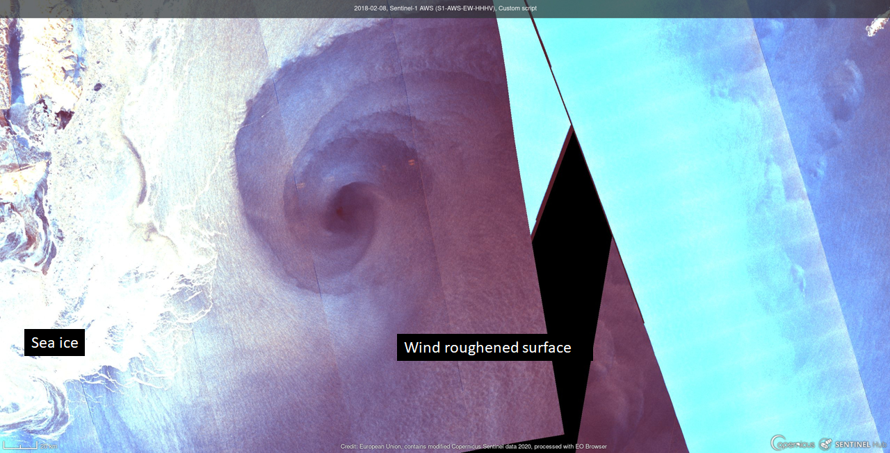
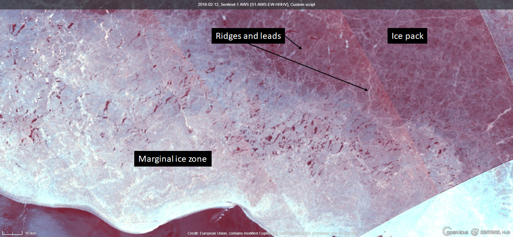
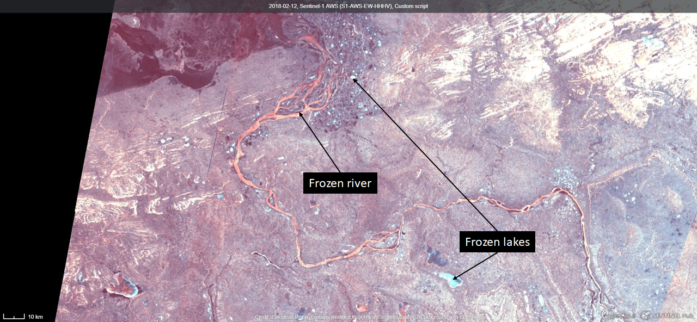

# SAR-Ice: A Sea Ice RGB Composite

<a href="#" id='togglescript'>Show</a> script or [download](sar-ice.js){:target="_blank"} it.


      


## Evaluate and visualize
 - [EO Browser](https://apps.sentinel-hub.com/eo-browser/?lat=67.227&lng=46.401&zoom=9&time=2018-02-12&preset=CUSTOM&gainOverride=0.4&gammaOverride=0.6&redRangeOverride=[0,0.608]&greenRangeOverride=[0,0.642]&blueRangeOverride=[0,0.675]&datasource=Sentinel-1%20AWS%20(S1-AWS-EW-HHHV)&layers=HH,HV,HV&evalscript=ZnVuY3Rpb24gb3ZlcmxheSh0b3AsIGJvdHRvbSkgewogIHZhciByZXMgPSAtKCgyICogdG9wIC0gMSkgKiBib3R0b20tIDIgKiB0b3ApICogYm90dG9tOwogIHJldHVybiByZXM7Cn0KCmZ1bmN0aW9uIHN0cmV0Y2goYXJyLCBtaW4sIG1heCkgewogIHZhciBkZWx0YSA9IG1heCAtIG1pbjsKICB2YXIgb2Zmc2V0ID0gLW1pbiAvIGRlbHRhOwogIHJldHVybiBhcnIvZGVsdGEgKyBvZmZzZXQ7Cn0KCmZ1bmN0aW9uIGdhbW1hKGFyciwgdmFsKSB7CiAgcmV0dXJuIGFyciAqKiAoMS4wIC8gdmFsKTsKfQoKdmFyIG1odiA9IE1hdGguc3FydChIViArIDAuMDAyKTsKdmFyIG1oaCA9IE1hdGguc3FydChISCArIDAuMDAyKTsKdmFyIG92ID0gb3ZlcmxheShtaGgsIG1odik7CnZhciByZWQgPSBnYW1tYShzdHJldGNoKG1odiwgMC4wMiwgMC4xKSwgMS4xKTsKdmFyIGdyZWVuID0gZ2FtbWEoc3RyZXRjaChvdiwgMC4wLCAwLjA2KSwgMS4xKTsKdmFyIGJsdWUgPSBnYW1tYShzdHJldGNoKG1oaCwgMC4wLCAwLjMyKSwgMS4xKTsKcmV0dXJuIFtyZWQsIGdyZWVuLCBibHVlXTsK){:target="_blank"}

## General description of the script

Sentinel 1 A and B SAR-C data is the most important sources of information  for operational ice-charting in many marine institutes nowadays. However, because of the lack of a good way to visualize data, only one of the polarizations (usually co-polarization) is used in EW (and sometimes IW) data stripes, and hence some important information can be overlooked.
With this new composite we developed, we propose a way to combine both co- and cross-polarization data into one single image, not only keeping the ice features easily distinguishable, but also showing clearly different states of the sea and sea-ice that are difficult to see in single band images.
The audience that will find the composite most useful is anyone who needs to discriminate various features and state of the water and sea ice, for example ship navigators, national ice services and meteorologists on duty, cryosphere field scientists and winter sports enthusiasts.

Note
The following description is showing how to build the composite from Sentinel-1A/B SAR-C, EW data. However, IW mode can also be used to generate this composite, by replacing HV with VH and HH with VV.

**Basic recipe**

Most sea-ice information in SAR data are usually available on the co-polarization channels, HH in the Sentinel-1 EW mode case. As we want this composite to be easily relatable to its main application, we  want the sea and sea ice to be mostly in the blue spectrum. Peculiar features should be shown in red.
Hence,  the RGB channels are populated in the follow fashion:

- Red is HV
- Blue is HH
- Green is a mixture of HH and HV

**Enhancements**

In order to make the image visually optimal, some enhancements are to be performed in combination with the recipe above.
First we apply the square root on the HH and HV channels and apply a little offset do dampen the effect of the grain noise on data:

                        HV_m = sqrt(HV + 0.002)

Then the following values are chosen to normalize the results:

- Red: Min value is 0.02, max is 0.10
- Green: Min is 0, max is 0.6
- Blue: Min is 0, max is 0.32

And finally a gamma correction with value 1.1 is applied to make the resulting image slightly brighter.

**Generation of the green channel**

The mixture used for green was chosen to keep Red and Blue dominant while keeping a pleasant overall palette of colours. Our solution is to use a variant of the Soft Light blend mode as described on the Pegtop software documentation pages (http://www.pegtop.net/delphi/articles/blendmodes/softlight.htm) or in the Gimp documentation (as Overlay https://docs.gimp.org/en/gimp-concepts-layer-modes.html), with HH as the top layer and HV as the bottom layer. It translates in our case to:

                        G = HV * (2 * HH + HV * (1 - 2 * HH))

where G is the resulting green channel.

**Notes on the  implementation of the composite on EOBrowser**

During the implementation of the composite on the EOBrowser, some limitations appeared:

- The units of the HH and HV quantities are not provided, and thus it took some guesswork to tune the composite to look as in our reference software.
- The noise correction isn't applied on the data in EOBrowser, which makes the image noisier than necessary
- There is strong incidence angle noise which should be removed for this application. However, no incidence angle dataset was available at the time of the implementation of this composite in the EOBrowser, which prevented us from performing adequate normalisation. As a consequence, some strong blue colour is to be expected towards the edge of the swath.

## Details of the script

EOBrowser provides access to the  measurements in extra wide (EW) mode and HH and HV polarizations. Spatial resolution is 40 meters per pixel. To better identify various natural features over land and ocean we take advantage of the dual polarimetric observations. HH measures horizontally returned proportion of the horizontally transmitted waves, while HV measures the proportion of the waves that have been transmitted horizontally and received vertically, thus we look at the rate of change of the signal polarization that happens on the ground level. It often happens due to the volumetric scattering of the underlying surface. In a nutshell HH channel is sensitive to reflected signal from the flat surface features, like flat ice and open water.  HV channel is sensitive to backscattered signal from surfaces like snow, canopy leaves, etcetera. By looking at the ratio of the HH and HV intensities we can draw conclusions about the processes that happen at the ground level. In some situations, when image interpretation is difficult, an ability to quickly look up in EOBrowser other data sources, like Sentinel-3, is extremely helpful!

Note
HV signal is typically much weaker compared to HH, therefore more noise will be present on the imagery. We use red band for HV, therefore large homogeneous reddish areas / stripes are due to the sensor noise. |

**Scripts applicability**

In this recipe we look at the following features that can be captured with our composite:

- Flat ice / rough ice
- First year ice / multi year ice
- Open water / wind
- Polynyas / frost flowers
- Frozen rivers and lakes

See also the [supplementary material](supplementary_material.pdf) for details.

## Authors of the script

Martin Raspaud, Mikhail Itkin

## Description of representative images

1) Calm ocean water / wind roughened ocean surface

The more flat the horizontal surface is, the less emitted radiation will reach back to the sensor. Thus the very smooth and flat surfaces like calm waters or young smooth ice will appear dark. There is very little volumetric scattering occurring so the blue channel intensity will prevail and finally calm waters will have dark blue colour on the images produced with our composite. When the winds over water strengthen, the intensity of the backscatter will increase and those areas will be of a brighter blue shade.

2) Flat ice / rough ice

Same principle will apply for the flat and rough ice with one difference: since the surface will contain ice, air bubbles and snow crystals, portion of the return signal will be more vertically polarised therefore HV will intensify and the area will have more red shade. In C-band frequency radar waves penetrated through the dry snow, so it is nearly invisible. Flat surface ice will appear dark blue, but roughened young ice types like ìpancakeî ice will have significantly higher intensity and produce a bright blue shade. This process is especially apparent in the marginal ice zone (the edge of the ice pack) where disturbed young ice meets flat floes frozen together. You can still see the ridges where floes connect to each other!

3) First year ice / multi year ice (winter time)

In winter using both, co- and cross polarised SAR measurements helps discrimination of first year ice (FYI) from multiyear ice (MYI). This is possible due to the larger presence of air bubbles  and lower salinity of the MYI, which increases volumetric scattering, and strengthening the HV response over MYI. This effect is strongly reduced in summer due to the presence of melt water on top of the ice which attenuates the C-band signal (Komarov and Buehner, 2019).

4) Polynyas and leads

Polynyas are regions of open water which occur when winds push sea ice away from the coast, which create the interface between very cold air and open water. Due to vicinity of the open water the air in the region is supersaturated and eventually moisture begins to condensate on the surface of the ice forming features called frost flowers (FF).  FF formation draws salty solution called brine from the surface of the sea ice and they are made of mostly the ice crystals. This causes a strong increase in HV response. It will give the area a bright yellow or orange colour on our composite and they can be easily spotted among the more darker regions of surrounding water and sea ice. For more details on the FF formation process see D. Islefson et al, 2018.

An example of such situation occurred in Chosha bay in Barents sea in February 2018. During relatively calm and cold days a lot of young ice formed in the bay. Under strong winds coming from the land a polynya has formed. The winter temperatures in the area are well below zero degrees Celsius. A brine appears on the surface of a growing ice, and after few days, when enough brine should have been available at the surface of the ice, a sudden increase in HV has occurred, which was most likely due to the appearance of frost flowers.
Same process happens in the new formed leads, which are cracks in the ice cover due to ice drift.

5) River ice / lake ice

Ice formation on the rivers versus lakes, even though they are both fresh water objects, is quite different due to the dynamic nature of the river flow. While lakes freeze relatively quickly and will have undisturbed ice and snow cover, river freezing is much more dynamic. Rivers often have ice jams and over-flooding where ice gets broken into pieces and soaked in water following another refreeze cycle. Frozen river surfaces will produce more intense colours in both HH and HV and the final image will appear as very bright red. In contrast lakes will remain blue as they mostly scatter incoming radiation at the surface and do not change incoming horizontal polarisation to vertical.
 
At the young stage of the river ice formation, the composite colour will be dark or bright blue, depending on the amount and roughness of the ice. As snow precipitates on the ice, and more jamming and refreezing processes occur, the colour will change to bright red.

## References

- A. S. Komarov and M. Buehner, "Detection of First-Year and Multi-Year Sea Ice from Dual-Polarization SAR Images Under Cold Conditions," in IEEE Transactions on Geoscience and Remote Sensing, vol. 57, no. 11, pp. 9109-9123, Nov. 2019. doi: 10.1109/TGRS.2019.2924868
- Gupta, Mukesh; Scharien, Randall K.; Barber, David G.  ìC-Band Polarimetric Coherences and Ratios for Discriminating Sea Ice Roughnessî, International Journal of Oceanography, 2013. doi: 10.1155/2013/567182
- Dustin Isleifson et al, ìInvestigations into Frost Flower Physical Characteristics and the C-Band Scattering Responseî, June 2018, Remote Sensing 10(7):991, doi: 10.3390/rs10070991
