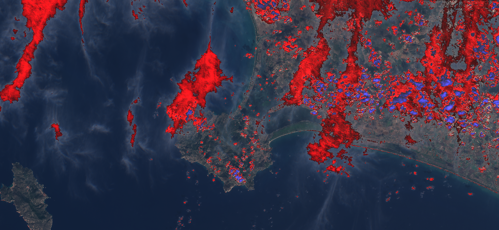

# Braaten-Cohen-Yang cloud detector

<a href="#" id='togglescript'>Show</a> original script or [download](script_bcy_original.js){:target="_blank"} it.


      


  

## Evaluate and visualize
- [Sentinel Playground](https://apps.sentinel-hub.com/sentinel-playground/?source=S2&lat=46.10942153064164&lng=14.8919677734375&zoom=9&maxcc=100&&time=2015-01-01%7C2017-06-06&evalscripturl=https%3A%2F%2Fraw.githubusercontent.com%2Fsentinel-hub%2FcustomScripts%2Fmaster%2Fsentinel-2%2Fcby_cloud_detection%2Fscript.js){:target="_blank"}
- [EO Browser](http://apps.sentinel-hub.com/eo-browser/#lat=42.437647200108685&lng=11.19283676147461&zoom=12&datasource=Sentinel-2%20L1C&time=2017-10-06&preset=CUSTOM&layers=B01,B02,B03&evalscript=ZnVuY3Rpb24gaW5kZXgoeCwgeSkgewoJcmV0dXJuICh4IC0geSkgLyAoeCArIHkpOwp9CgpmdW5jdGlvbiBjbGlwKGEpIHsKICByZXR1cm4gTWF0aC5tYXgoMCwgTWF0aC5taW4oMSwgYSkpOwp9CgpsZXQgTkdEUiA9IGluZGV4KEIwMiwgQjAzKTsKbGV0IGJSYXRpbyA9IChCMDIgLSAwLjE3NSkgLyAoMC4zOSAtIDAuMTc1KTsKbGV0IGdhaW4gPSAyLjU7CgppZiAoYlJhdGlvID4gMSkgeyAvL2Nsb3VkCiAgdmFyIHYgPSAwLjUgKiAoYlJhdGlvIC0gMSk7CiAgcmV0dXJuIFswLjUgKiBjbGlwKEIwNCksIDAuNSAqIGNsaXAoQjAzKSwgMC41ICogY2xpcChCMDIpICsgdl07Cn0KCmlmIChiUmF0aW8gPiAwICYmIE5HRFI%2BMCkgeyAvL2Nsb3VkCiAgdmFyIHYgPSA1ICogTWF0aC5zcXJ0KGJSYXRpbyAqIE5HRFIpOwogIHJldHVybiBbMC41ICogY2xpcChCMDQpICsgdiwgMC41ICogY2xpcChCMDMpLCAwLjUgKiBjbGlwKEIwMildOwp9CgoKcmV0dXJuIFtCMDQsIEIwMywgQjAyXS5tYXAoYSA9PiBnYWluICogYSk7Cg%3D%3D){:target="_blank"}

## General description
In  [1] Braaten, Cohen, and Yang describe a very simple cloud detection algorithm. The whole cloud detection is a simple threshold-based test:   
$$(B03 > 0.175 \land \mathtt{NDGR} > 0) \lor B03 > 0.39$$   

where
$$\mathtt{NDGR} := \mathtt{Index}(B03, B04) = \frac{B03 - B04}{B03 + B04}$$   

One can think of this formula as describing a subspace (of the space of Sentinel-2 responses) that contains most of the clouds. The same thing could be written more concisely - the NDGR threshold is really just $B03>B04$.

### Assessment of quality

On the Hollstein data set this algorithm achieves 73% classification accuracy; most of the error comes from detecting snow as cloud and failing to detect thin clouds. The corresponding confusion matrix (entries along the left column are taken from Hollstein data, so 8% means that from among all pixels in the train set there are 8% that are clouds but weren't detected):

| |  cloud           |  Ncloud         |   
|:------|:-----------------|:----------------|   
|cloud  |  1142085  (20%)  |  460329 (8%)    |   
|Ncloud |  1027308 (18%)   |  3017989 (53%)  |   

However, this algorithm doesn't detect thin clouds (e.g. transparent and translucent clouds) as well as misclassifies snow for cloud. One way to alleviate this is to use SWIR bands to help differentiate snow from cloud:   
$$B11>\tau\land ((B03 > 0.175 \land \mathtt{NDGR} > 0) \lor B03 > 0.39),$$   
where we use $\tau=0.2$.

The threshold for $\tau$ was chosen arbitrarily; a more educated guess would probably give better results. Nevertheless, with such modification we achieve 88% classification accuracy on the Hollstein data set. Most of the error comes from non-detection of cirrus clouds.

Try it on [Sentinel Playground](https://apps.sentinel-hub.com/sentinel-playground/?lat=46.65120371539995&lng=13.809814453125&zoom=13&preset=CUSTOM&layers=B04,B03,B12&maxcc=50&time=2015-01-01%7C2017-06-06&evalscript=dmFyIGJSYXRpbyA9IChCMDIgLSAwLjE3NSkgLyAoMC4zOSAtIDAuMTc1KTsKdmFyIE5HRFIgPSAoQjAyIC0gQjAzKSAvIChCMDIgKyBCMDMpOwoKZnVuY3Rpb24gY2xpcChhKSB7CiAgcmV0dXJuIE1hdGgubWF4KDAsIE1hdGgubWluKDEsIGEpKTsKfQoKaWYgKEIxMT4wLjEgJiYgYlJhdGlvID4gMSkgeyAvL2Nsb3VkCiAgdmFyIHYgPSAwLjUqKGJSYXRpbyAtIDEpOwogIHJldHVybiBbMC41KmNsaXAoQjA0KSwgMC41KmNsaXAoQjAzKSwgMC41KmNsaXAoQjAyKSArIHZdOwp9CgppZiAoQjExID4gMC4xICYmIGJSYXRpbyA%2BIDAgJiYgTkdEUj4wKSB7IC8vY2xvdWQKICB2YXIgdiA9IDUgKiBNYXRoLnNxcnQoYlJhdGlvICogTkdEUik7CiAgcmV0dXJuIFswLjUgKiBjbGlwKEIwNCkgKyB2LCAwLjUgKiBjbGlwKEIwMyksIDAuNSAqIGNsaXAoQjAyKV07Cn0KCnJldHVybiBbMipCMDQsIDIqQjAzLCAyKkIwMl07){:target="_blank"} or download the script from [here](script.js){:target="_blank"}.   

## Description of representative images

Braaten-Cohen-Yang cloud detector, of Orbetello, Italy. Acquired on 6.10.2017.

## References
- [1] Braaten J, Cohen WB, Yang Z. 2015. _Automated cloud and cloud shadow identification in Landsat MSS imagery for temperate ecosystems_. Remote Sensing of Environment. 169:128-138.
