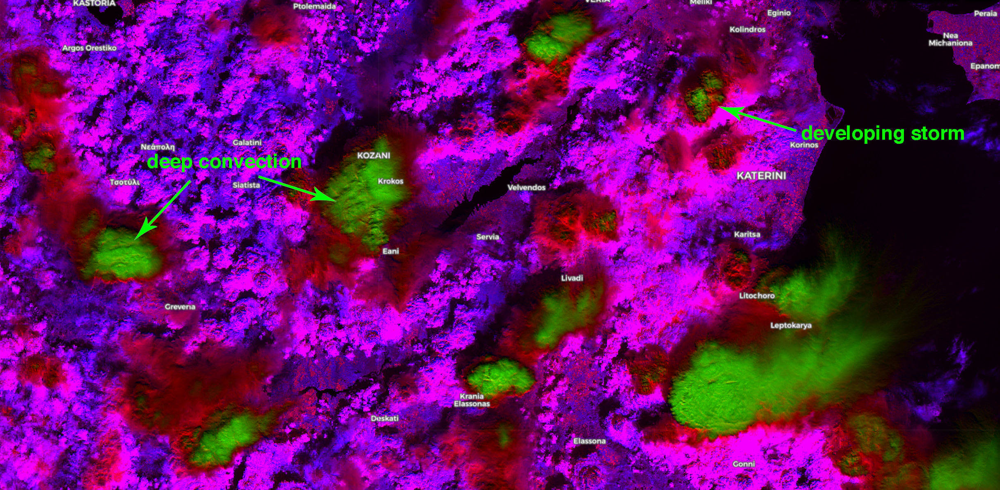
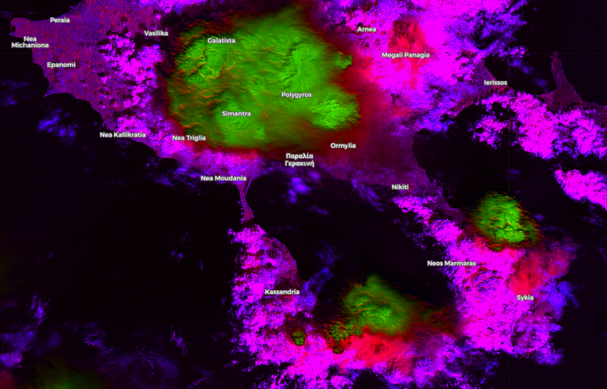
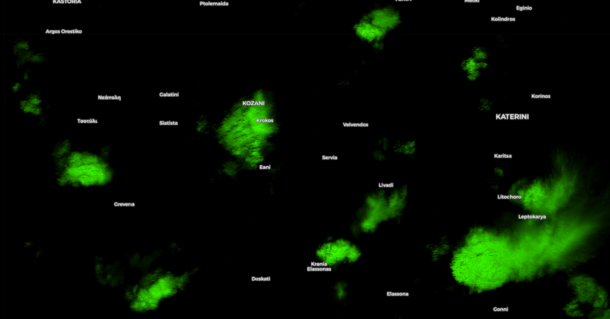

# Detecting Deep Moist Convection Script

## Evaluate and visualize
 - [Sentinel Playground](https://apps.sentinel-hub.com/sentinel-playground/?source=S2&lat=40.1626081299121&lng=21.917037963867188&zoom=10&preset=CUSTOM&layers=B01,B02,B03&maxcc=100&gain=1.0&gamma=1.0&time=2018-10-01%7C2019-04-14&atmFilter=&showDates=false&evalscript=LyoKQXV0aG9yIG9mIHRoZSBzY3JpcHQ6IFN0YXZyb3MgRGFmaXMKKi8KCmZ1bmN0aW9uIFMgKGEgLCBiKSB7IHJldHVybiBhIC0gYiB9OwoKbGV0IGdhaW4gPSAyLjU7Cgp2YXIgTUlEQ0wgPSBTKEIwOCwgQjA5KSAKdmFyIERDID0gUyhCMTAsIEIxMikgICAgCnZhciBMT1dDTCA9IFMoQjExLCBCMTApICAgIAoKcmV0dXJuIFtNSURDTCwgREMsIExPV0NMXS5tYXAoYSA9PiBnYWluICogYSk7Cg%3D%3D){:target="_blank"}    
 - [EO Browser](https://apps.sentinel-hub.com/eo-browser/?lat=40.1626&lng=21.9170&zoom=10&time=2019-04-14&preset=CUSTOM&datasource=Sentinel-2%20L1C&layers=B01,B02,B03&evalscript=LyoKQXV0aG9yIG9mIHRoZSBzY3JpcHQ6IFN0YXZyb3MgRGFmaXMKKi8KCmZ1bmN0aW9uIFMgKGEgLCBiKSB7IHJldHVybiBhIC0gYiB9OwoKbGV0IGdhaW4gPSAyLjU7Cgp2YXIgTUlEQ0wgPSBTKEIwOCwgQjA5KSAKdmFyIERDID0gUyhCMTAsIEIxMikgICAgCnZhciBMT1dDTCA9IFMoQjExLCBCMTApICAgIAoKcmV0dXJuIFtNSURDTCwgREMsIExPV0NMXS5tYXAoYSA9PiBnYWluICogYSk7Cg%3D%3D){:target="_blank"} 

## General description of the script

Deep moist convection (DC) is associated with hazardous weather phenomena such as torrential rainfall and flash floods, severe convective wind gusts, large hail, and tornadoes. The latent heat release inside deep convective clouds plays a crucial role in several phenomena, for example, the intensification of hurricanes and cyclones in general. Several studies have shown that DC and overshooting cloud tops penetrate the lowest stratosphere and allow the exchange of gases from the troposphere deep into the stratosphere. 

For all the aforementioned reasons, I believe the Sentinel constellation of satellites provide a unique opportunity to monitor DC around the globe, regardless the ground emissivity which is a major problem in other remote sensing techniques using the microwave and infrared spectrum. In addition, infrared channels from geostationary satellites may provide misleading information about the actual areas covered with DC due to high-level clouds (e.g. Cirrus canopy), let alone the lower spatial resolution compared to Sentinel.

The author has developed a very simple script for detecting DC with the Sentinel-2 L1C datasets which can be modified for the L2A and Sentinel-3 datasets as well. He describes the performance of the algorithm in a case study in Greece in April 2019 ( see [supplementary material](supplementary_material.pdf) ). There is a potential for this script to be further optimized and evaluated in the near future and he would be interested to use external sources to provide the best possible results.

## Author of the script

Stavros Dafis

## Description of representative images

Figure 1: The output of the DC algorithm for North Greece (lat=40.1961&lng=21.8860) on 14 April 2019 at 09:29 UTC, showing with green color the areas covered with deep convection (thunderstorms), with red mid-level clouds (precipitating or not) and with magenta/blue low-level cloudiness.

Figure 2: The output of the DC algorithm for North Greece (Chalkidiki, 40.2486&lng=23.1576) on 14 April 2019 at 09:29 UTC, showing with green color the areas covered with deep convection (thunderstorms), with red mid-level clouds (precipitating or not) and with magenta/blue low-level cloudiness.

Figure 3: Composite radar reflectivity (dBz) in North Greece on 14 April 2019 at 09:28 UTC, showing with green color precipitating areas (light rain/drizzle), with blue intense rainfall, and with orange/pink/red areas with heavy rain and/or hail. The red box corresponds to the domains in Fig. 1 and the blue box to the same domain in Fig. 2 with 1-minute lag.

Figure 4: A mask for the DC algorithm for North Greece (lat=40.1961&lng=21.8860) on 14 April 2019 at 09:29 UTC, showing with green color only the areas covered with deep convection (thunderstorms). The domain is almost similar as in Fig 1 and the red box in Fig. 3.

See the [supplementary material](supplementary_material.pdf) for more details.
