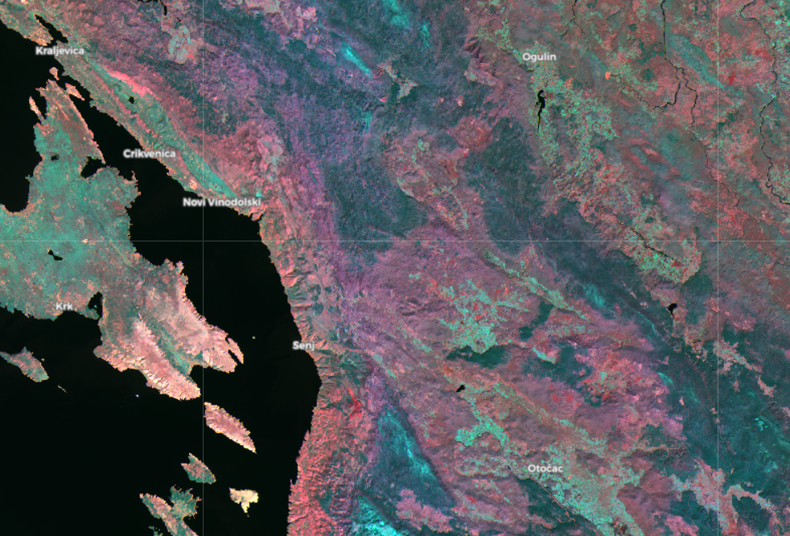

# False Color Composite Script

## Evaluate and visualize
 - [Sentinel Playground](https://apps.sentinel-hub.com/sentinel-playground/?source=S2&lat=45.068671318263945&lng=14.827766418457031&zoom=11&preset=CUSTOM&layers=B01,B02,B03&maxcc=20&gain=1.0&gamma=1.0&time=2018-10-01%7C2019-04-16&atmFilter=&showDates=false&evalscript=LyoKQXV0aG9yOiBNb25qYSBTZWJlbGEKKi8KCi8qVmVyc2lvbiAxOiBuYXR1cmFsIGNvbG9yOgpyZXR1cm4gW0IxMiAqIDIuNSwgQjA3ICogMS41LCBCMDkgKiAyLjUgXTsgIAoqLwoKLy9WZXJzaW9uIDI6IGxpZ2h0ZXIsIHZpdmlkIGNvbG9yczoKbGV0IGdhaW4gPSAxLjUKcmV0dXJuIFtCMTIgKiAyLjUsIEIwNyAqIDEuNSwgQjA5ICogMi41IF0ubWFwKGEgPT4gZ2FpbiAqIGEpOyAgIAo%3D){:target="_blank"}    
 - [EO Browser](https://apps.sentinel-hub.com/eo-browser/?lat=45.0687&lng=14.8278&zoom=11&time=2019-04-16&preset=CUSTOM&datasource=Sentinel-2%20L1C&layers=B01,B02,B03&evalscript=LyoKQXV0aG9yOiBNb25qYSBTZWJlbGEKKi8KCi8qVmVyc2lvbiAxOiBuYXR1cmFsIGNvbG9yOgpyZXR1cm4gW0IxMiAqIDIuNSwgQjA3ICogMS41LCBCMDkgKiAyLjUgXTsgIAoqLwoKLy9WZXJzaW9uIDI6IGxpZ2h0ZXIsIHZpdmlkIGNvbG9yczoKbGV0IGdhaW4gPSAxLjUKcmV0dXJuIFtCMTIgKiAyLjUsIEIwNyAqIDEuNSwgQjA5ICogMi41IF0ubWFwKGEgPT4gZ2FpbiAqIGEpOyAgIAo%3D){:target="_blank"} 

## General description of the script

The script is useful for land cover/use classification, including soil and rock type classification on barren grounds. It shows land cover and land use in a natural and pleasing way, separating various vegetation types, agriculture, barren ground, water, snow, and dwellings. The barren ground is colored in hues from yellow to dark brown, depending on soil or rock type. Urban areas also appear brown or orange. Completely barren ground, such as landslides, stone quarries or barren agriculture fields appear bright orange and are thus easy to differentiate. For example, stone quarries pop out especially clearly. Water bodies appear black and are easily differentiated from other elements. Forests have various shades of green, ranging from dark green to aqua, based on, I believe, vegetation type and health, since color variations look like those of infrared false color composite. Grass fields are always relatively lighter green. Other types of vegetation, such as dry grass or makia have different, darker colors.
 
The script does not work well under clouds, which are colored differently, ranging from white, yellow, pink, red and blue, due to the water vapor band. Although it might be useful for cloud identification, smaller clouds can mislead about what is on the surface.

See [supplementary material](supplementary_material.pdf) for additional information.

## Author of the script

Monja Sebela

## Description of representative images

False Color Composite script showing the area around Senj, Croatia.

