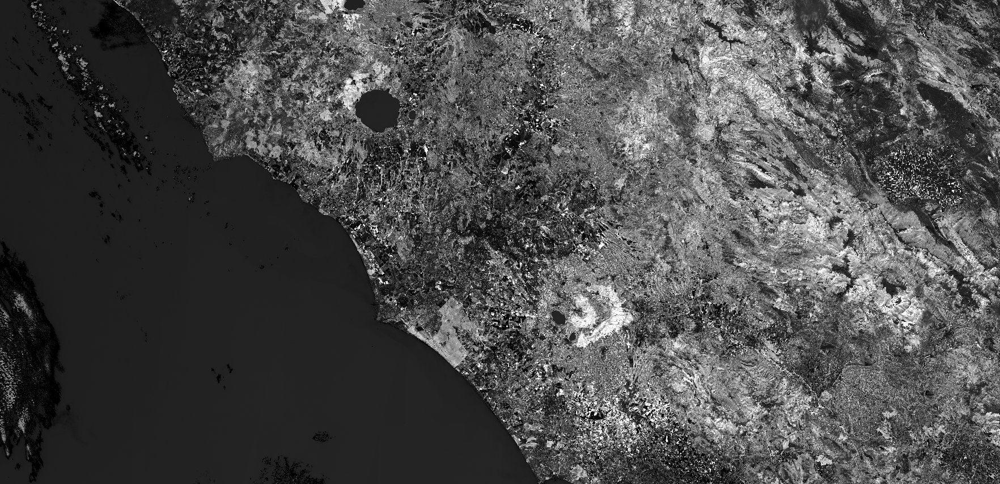

# SIPI (Structure Insensitive Pigment Index)
<a href="#" id='togglescript'>Show</a> script or [download](script.js){:target="_blank"} it.


      


## Evaluate and visualize
 - [Sentinel Playground](https://apps.sentinel-hub.com/sentinel-playground/?source=S2&lat=43.514198796857976&lng=16.601028442382812&zoom=11&evalscripturl=https://raw.githubusercontent.com/sentinel-hub/custom-scripts/master/sentinel-2/sipi/script.js){:target="_blank"}    
 - [EO Browser](http://apps.sentinel-hub.com/eo-browser/#lat=41.9&lng=12.5&zoom=10&datasource=Sentinel-2%20L1C&time=2017-10-08&preset=CUSTOM&layers=B01,B02,B03&evalscripturl=https://raw.githubusercontent.com/sentinel-hub/custom-scripts/master/sentinel-2/sipi/script.js){:target="_blank"}   
 When EO Browser loads, switch to **code view**, then check the **Use URL** checkbox and press **Refresh**.

## General description of the script

The SIPI index maximizes sensitivity to the bulk carotenoids to chlorophyll ratio, while minimizing the impact of the variable canopy structure. It is very useful in areas with high variability in the canopy structure, or leaf area index..

Values description: SIPI values range from 0 to 2, where healthy green vegetation ranges from 0.8 to 1.8.

## Description of representative images

SIPI of Rome. Acquired on 8.10.2017.

