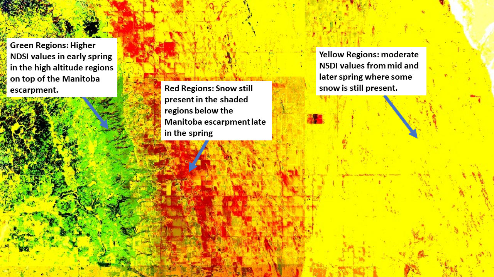

# Snow Cover Change Detection

## Evaluate and visualize
 - [Example 1](https://sentinel-hub.github.io/custom-scripts/sentinel-2/snow_cover_change/example1.html){:target="_blank"}

## General description of the script

The Snow Cover Change Detection script calculates the NDSI for any given region for the last three months and renders the results so that areas which have gained/lost snow can be easily identified.

This script works great for viewing snowfall in the autumn months or snow retreat in the spring. Additionally, this script can be used to visualize glacial retreat or advance in polar or high mountain regions.

## Author of the script

Karl Chastko

## Description of representative images

The images below demonstrate how the script can be used to track glacial retreat and spring snowmelt.

The first image shows the summer retreat of the Athabasca glacier in Western Alberta Canada from June 2018 - August 2018.

The second image displays patterns of spring thaw (largely related to local topography) along the Manitoba escarpment in Manitoba Canada.

Generally speaking regions in blue and green highlight areas which have high snow cover in the earliest months while red values highlight areas which maintain snow cover in the later months. Combinations of these colors represent areas which remain snow covered across multiple time periods. Images show the result of the script using the default parameters.
