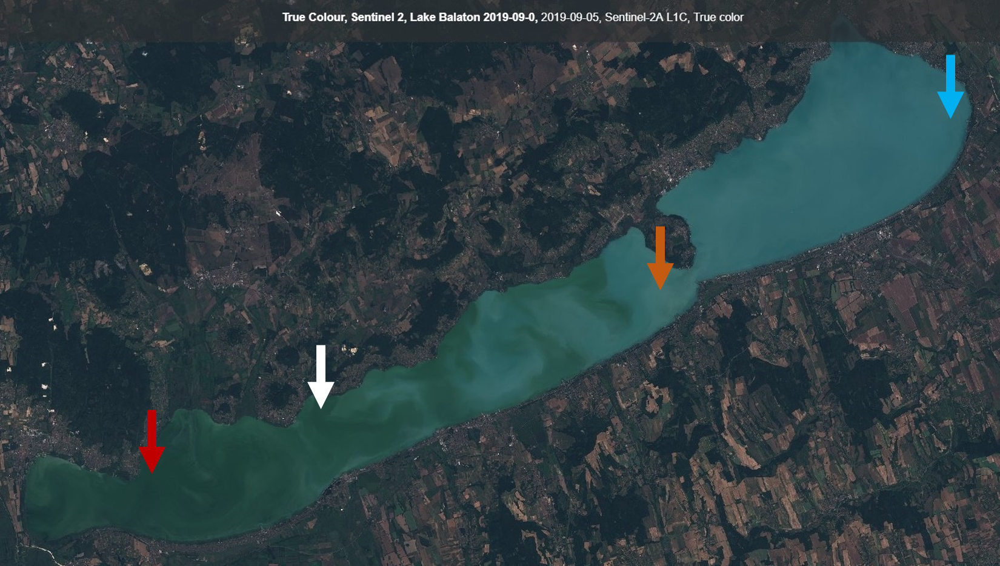
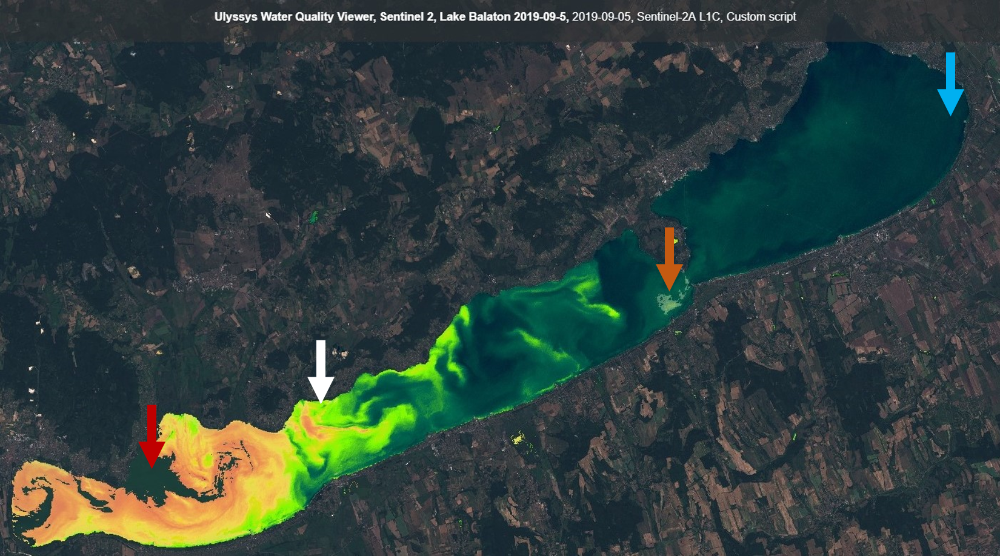
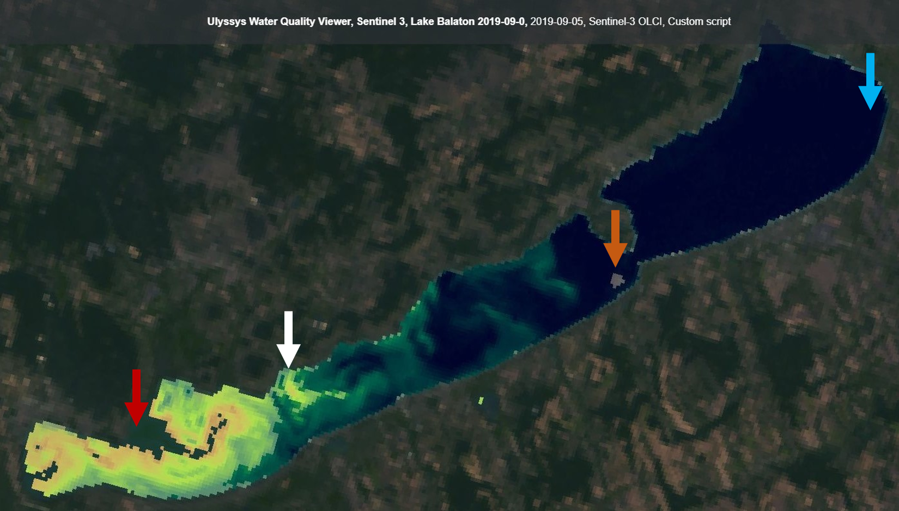
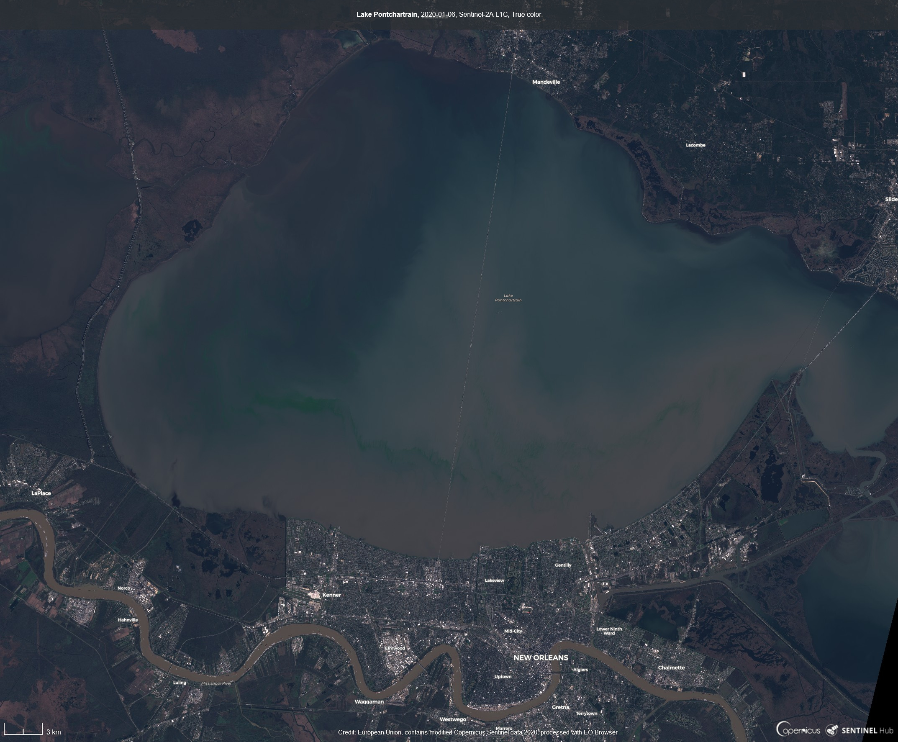
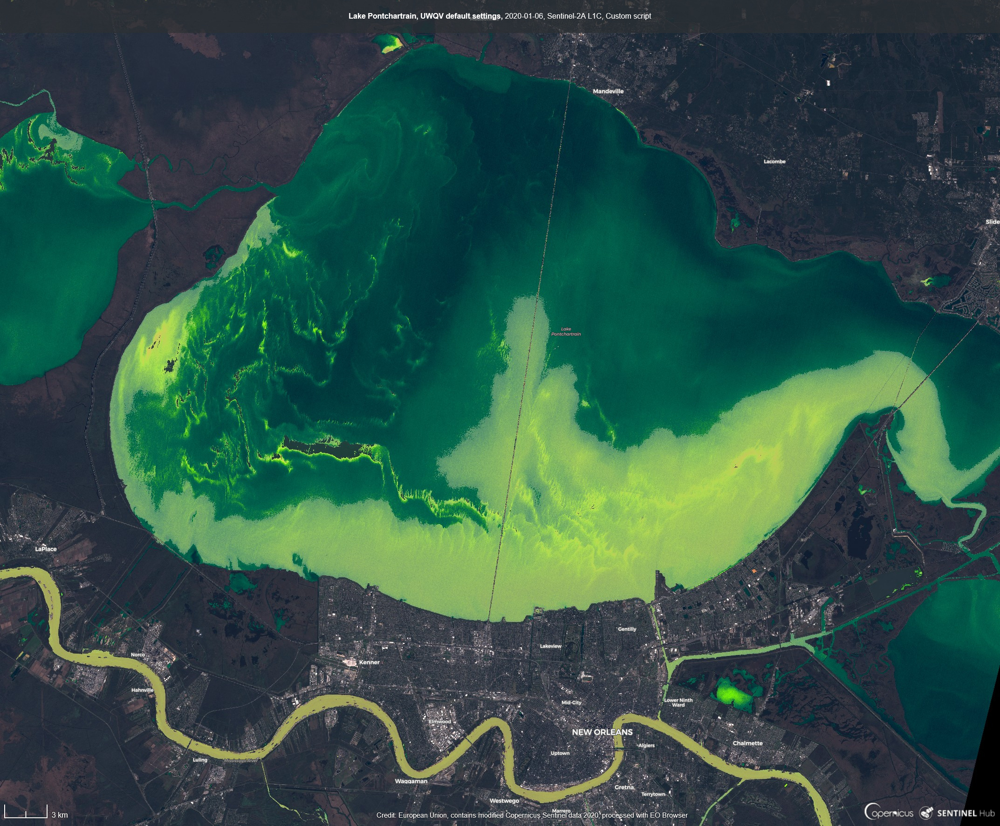
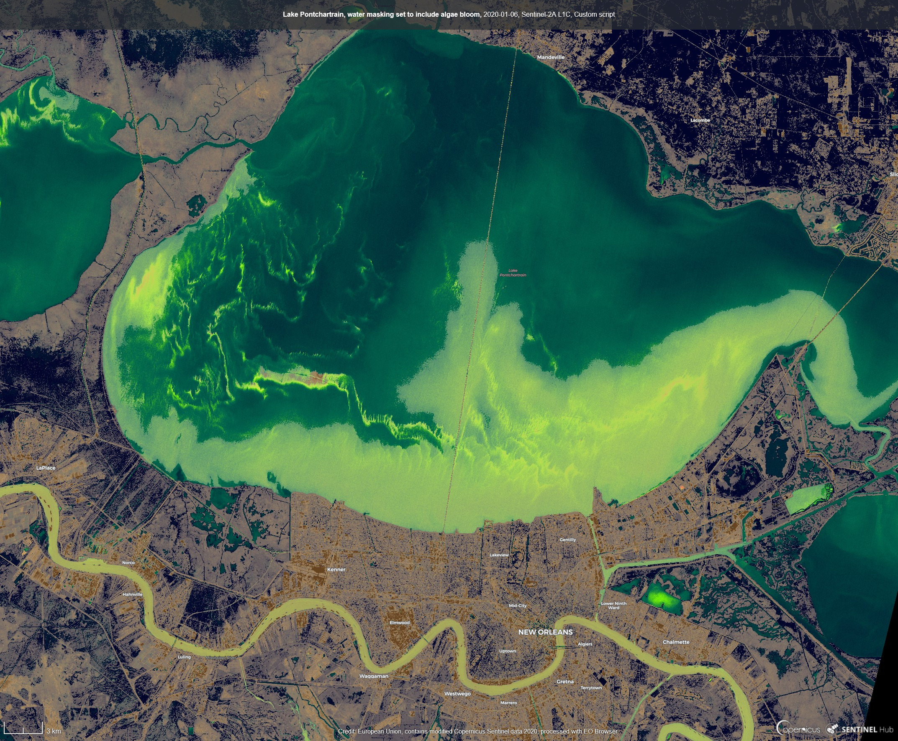
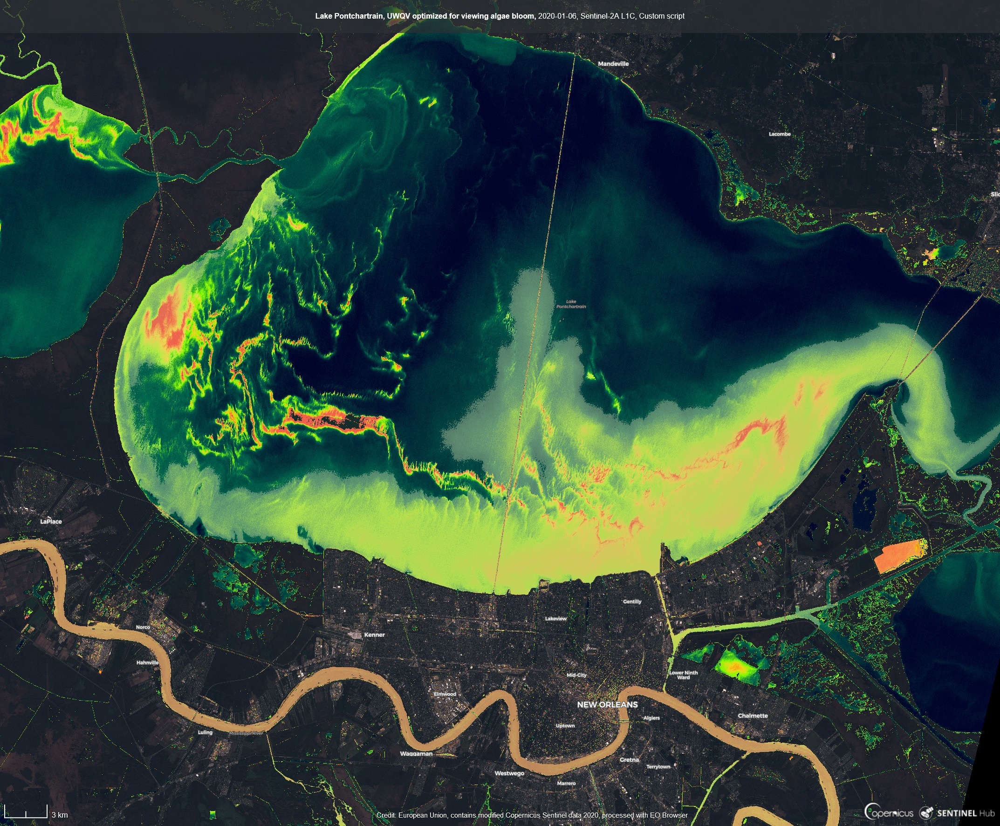

# Ulyssys Water Quality Viewer (UWQV)

> Water quality visualization script for Sentinel-2 and Sentinel-3 imagery data

[Show](dist/script.min.js) minified, optimized script (recommended for usage).

[Show](src/script.js) unminified script (for debugging purposes).

[//]: # (https://apps.sentinel-hub.com/eo-browser/?lat=46.7587&lng=17.3728&zoom=12&time=2019-02-27&preset=1_TRUE_COLOR&datasource=Sentinel-2%20L1C)


[//]: # (https://apps.sentinel-hub.com/eo-browser/?lat=46.8795&lng=17.7214&zoom=11&time=2019-09-05&preset=1_TRUE_COLOR&datasource=Sentinel-2%20L1C)


# Evaluate and visualize

1. Visit one of the following example sites or find your own area of interest:
   - Lake Balaton, Hungary, Europe (2019-09-05)
     - [EO Browser](https://tinyurl.com/stdt8q9) (Sentinel-2)
     - [Sentinel-hub Playground](https://tinyurl.com/u4tlenl) (Sentinel-2)
     - [EO Browser](https://tinyurl.com/r9vmpfd) (Sentinel-3)
   - Lake Pontchartrain, Louisiana, USA (2020-01-06)
     - [EO Browser](https://tinyurl.com/vwtv4ql) (Sentinel-2)
     - [EO Browser](https://tinyurl.com/uw339kd) (Sentinel-3)
   - Balaclava Island, Australia (2019-09-05)
     - [EO Browser](https://tinyurl.com/wabpktf) (Sentinel-2)
   - Tsimlyansk Reservoir, Russia (2019-09-05)
     - [EO Browser](https://tinyurl.com/vnt2ona)
   - North Azadegan Oil Field, Iraqian/Iranian border (2019-09-08)
     - [EO Browser](https://tinyurl.com/v4yptnt) (Sentinel-2)
     - [EO Browser](https://tinyurl.com/whkgzlz) (Sentinel-3)
   - Lake Francis Case, South Dakota, USA (2019-09-13)
     - [EO Browser](https://tinyurl.com/w7rphzg) (Sentinel-2)
2. Interpret what you see
3. Modify the values in the `PARAMS` object according to your needs (for possible values see `Understanding and fine tuning PARAMS`)
4. Hit `Refresh` after modifying any of the properties 

## Description of the script

Ulyssys Water Quality Viewer (UWQV) is a custom script for the [Sentinel-hub EO-Browser](https://apps.sentinel-hub.com/eo-browser/) or the [Sentinel-hub Playground](https://apps.sentinel-hub.com/sentinel-playground/) to dynamically **visualize the chlorophyll and sediment conditions of water bodies on both Sentinel-2 and Sentinel-3 images**.

The visualization you see is a product of two masking operations and two water quality parameter visualizations:

- cloud masking
- water masking

and

- **suspended sediment concentration visualization**
- **chlorophyll concentration visualization**

By default, all pixels identified as "not water" (cloud, snow or land) are shown in true colour. All pixels identifed as water are coloured with an algorithm that evaluates chlorophyll and suspended sediment concentration together. This visualization can be compared to a GIS map with two raster layers, sediment on top and chlorophyll below. The sediment "layer" is semi-transparent and can cover the chlorophyll "layer". Just like clouds in the atmosphere, sediment in the water reduces transparency and obscures chlorophyll. Therefore water pixels with high sediment concentrations are coloured dark brown regardless of their chlorophyll concentration. Medium sediment concentrations are coloured wheat (light brown) with increasing transparency towards lower sediment concentrations. At low sediment concentrations the sediment "layer" is completely transparent. Below the semi-transparent sediment "layer", the chlorophyll concentration is visualized. High chlorophyll concentrations are marked in red, medium concentrations green, and low concentrations dark blue (see palette image below).


By changing input parameters of the script it is also possible to:

- visualize only sediment or only chlorophyll concentrations
- switch between various cloud and water masking algorithms (even switching masking off completely)
- alter the default numeric thresholds (min/max values) to adjust visualization to fit local conditions better
- render water (foreground) and/or non-water (background) pixels with the true colour image or a single constant colour with opacity

### Understanding and fine tuning `PARAMS`

The visual output is controlled by the `PARAMS` object defined at the beginning of the script. It has three logical parts: **Indices**, **Limits** and **Graphics**. You may control the visualization by fine tuning the properties, setting them to predefined values (e.g. changing the selected chlorophyll index from `'default'` to `'rlh'`) or modifying numeric values (e.g. chlorophyll maximum value from 0.05 to 0.03). Some of the properties are nullable (e.g. if you only wish to see sediment without chlorophyll just set `chlIndex` to `null` without quotation marks). You may see unwanted results if the properties are incorrectly set.

Structure and default values:

```javascript
const PARAMS = {
  // Indices
  chlIndex: "default",
  tssIndex: "default",
  watermaskIndices: ["ndwi", "hol"],
  // Limits
  chlMin: -0.005,
  chlMax: 0.05,
  tssMin: 0.075,
  tssMax: 0.185,
  waterMax: 0,
  cloudMax: 0.02,
  // Graphics
  foreground: "default",
  foregroundOpacity: 1.0,
  background: "default",
  backgroundOpacity: 1.0
};
```

Possible values:

- `chlIndex`: selected chlorophyll index (see Technical details for more information)
  - `'mci'` or `'rlh'` for Sentinel-2
  - `'flh'` or `'rlh'` or `'mci'` for Sentinel-3
  - `'default'` for default value (`'mci'` for Sentinel-2, `'flh'` for Sentinel-3)
  - `null` (without quotation marks) if not set, in this case chlorophyll is not visualized
- `tssIndex`: selected sediment index (see Technical details for more information)
  - `'b05'` for Sentinel-2
  - `'b07'` or `'b11'` for Sentinel-3
  - `'default'` for default value (`'b05'` for Sentinel-2, `'b11'` for Sentinel-3)
  - `null` (without quotation marks) if not set, in this case sediment is not visualized
- `watermaskIndices`: selected water/cloud mask indices (see Technical details for more information)
  - an array of `'ndwi'`, `'hol'`, `'bcy'` or any combination of them (`'bcy'` is only applicable for Sentinel-3)
  - `[]` (empty array) if not set
- `chlMin`: lower limit of `chlIndex`; decrease this for more sensitivity to low chlorophyll concentrations
- `chlMax`: upper limit of `chlIndex`; decrease this for stronger highlighting of high chlorophyll concentrations
- `tssMin`: lower limit of `tssIndex`; decrease this for more sensitivity to low sediment concentrations (but a higher chance of mistaking sediment for chlorophyll)
- `tssMax`: upper limit of `tssIndex`; decrease this for stronger highlighting of high sediment concentrations
- `waterMax`: upper limit of NDWI; if NDWI is above this limit the pixel is assumed to be water. Decrease this for more water but more commission errors
- `cloudMax`: minimum value for BCY cloud detection. Only affects the output if `'bcy'` is in `watermaskIndices`. Decrease this for higher sensitivity to clouds, increase for less clouds (and more water)
- `foreground`: fill type of water areas
  - `'default'`: fill the water pixels with the UWQV visualization (combine chlorophyll and sediment)
  - `'natural'`: for natural color image
  - custom color with an array of RGB colors (e.g. `[83, 109, 254]` for blue).
- `foregroundOpacity`: opacity of foreground layer over the background layer, between 0.0 (fully transparent) and 1.0 (fully opaque).
- `background`: fill type of non-water (background) areas
  - `'natural'` for natural color image
  - `'black'` for black background
  - `'white'` for white background
  - `'default'` for default value (`'natural'`)
  - custom color with an array of RGB colors (e.g. `[255, 255, 0]` for yellow)
- `backgroundOpacity`: opacity of background fill over natural color image, between 0.0 (fully transparent), showing true colour non-water pixels and 1.0 (fully opaque), showing single colour background.

## Details of the script

### Scientific background

From an ecological perspective, the term "water quality" refers to the status of the most important abiotic and biotic properties of the water column in a given time and location. The most important water quality parameters from a habitat management perspective are chlorophyll concentration and suspended sediment concentration, and these are also strongly linked to bathing and drinking water quality for human use (see supplementary for further details).
Chlorophyll concentration is a proxy for the amount of algae and therefore of energy and biomass input into the aquatic food web via photosynthesis. Since algae growth is often limited by the availability of nutrients, high chlorophyll concentrations are frequently a result of pollution from communal sewage or agricultural runoff.
Suspended sediment can originate from currents or waves moving the sediment up from the bottom of the water (called resuspension), or from tributary rivers that carry sediment as they flow. The amount of sediment in the water column also depends strongly on grain size: fine-grained sediment can be picked up by slow currents and takes long to settle down again, while larger grained sediment is only moved by very strong currents and settles very quickly.

### Technical background

The script uses pre-existing and relatively widely tested algorithms for masking and visualization. Water surfaces are masked by NDWI thresholding, (McFeeters 1996), and two existing cloud mask scripts in the Sentinel Hub repository are integrated, `hol` and `bcy` (Hollstein 2015; Cohen, Braaten and Young 2016). For suspended sediment, we use simple intensities of a single band near 700 nm or 620 nm (Nechad 2010, Sentinel 3 user guide).
For chlorophyll concentration, various indices area available, all based on the reflectance line height (RLH) algorithm. RLH involves calculating the difference ("height") of reflectance in one spectral band compared to a baseline calculated by linear interpolation between the values of two other bands (Yacobi 1995). Two specific spectral bands have been identified where chlorophyll flourescence produces a peak, at 685 nm and at 709 nm, and by calculating a RLH compared to the neighbouring bands defines two spectral indices, named Fluorescence Line Height (FLH) (Gitelson 1994) and Maximum Chlorophyll Index (MCI) respectively for studies with the MERIS satellite sensor (Gower 2005). Both of these indices can be calculated for Sentinel-3 data, and it has been shown that `flh` is more suitable for low chlorophyll concentrations while `mci` performs better for high chlorophyll concentrations. However, Sentinel-2 does not have a spectral band at 700 nm, so FLH cannot be used, but Band 05 at 705 nm is suitable for calculating `mci`. Additionally, for the sake of continuity we provide two RLH-based indices that were part of the functionality of Global Lake Watch (Zlinszky Supan Koma 2017), under the name `rlh`. These are both modified versions of the MCI with different baseline bands that we believe could be less sensitive to chlorophyll (Schalles 1998). Please see the References section for full citations and the supplementary material for full discussion of the methods selected.

### Limitations and typical problems

UWQV is just a visualization, not a quantitative map. The colours produced by the script are a function of the satellite image pixel values which in turn are mainly, but not exclusively determined by the chlorophyll and sediment concentrations in the water column. The indices we use are tested to be positively correlated to the water quality parameter values they represent, but the exact correlation functions can vary considerably between different locations and different atmospheric and water conditions. Nevertheless, we believe that UWQV can help to understand the properties and dynamics of aquatic ecosystems in a new way by providing high spatial or temporal resolution from the Sentinel 2 and 3 satellites.

We are aware of some typical cases where the algorithm produces errors:

- Cloud haze or thin clouds over water are sometimes missed by cloud masking, and these false water pixels will be shown to have have erroneously high suspended sediment concentrations. These cases are relatively easy to identify since the haze is visible in the true colour areas outside the water surface. To create a stricter cloud mask, one thing to try is to add `'bcy'` to `watermaskIndices` and decrease the `cloudMax` parameter.
- Similarly, cloud shadows are not always perfectly masked, and they can be mistaken as water areas with low suspended sediment. Cloud shadows can be identified based on the presence of clouds, which typically keep their natural colour at the default settings of our algorithm. For this problem, the first thing to try is to increase the `waterMax` parameter.
- Very high concentrations of suspended sediment or chlorophyll may cause the Hollstein algorithm or the NDWI-based water masking algorithm to fail, mistaking water areas for land. In this case, the algorithm returns the background image (by default the natural color image). To correct this, try:
  - set `watermaskIndices` to `['ndwi']` (delete `hol`),
  - secrease the value of `waterMax` (e.g. to -0.2) or
  - completely disable water and cloud masking (set `watermaskIndices` to `[]`)
- Also, relatively dark unvegetated land pixels (such as bare soil areas or deciduous forests in winter) sometimes fool the NDWI water masking algorithm, showing large water areas. Our recommended solution is to try tuning the `waterMax` parameter, increasing e.g. up to 0.45 to decrease these effects.
- The optical signal of chlorophyll and suspended sediment can not always be spectrally separated with these simple methods. This is especially problematic for Sentinel 2, where chlorophyll detection is based both for `mci` and for `rlh` on the peak of B05 above the neighbouring channels, and suspended sediment visualization is also based on B05 intensity. Therefore in some cases, low concentrations of bright sediment may influence the chlorophyll visualization. Similarly, in very transparent but shallow waters, the lake/sea bottom may be visible through the water and produce a sediment or chlorophyll signal. This effect can be especially prominent when only a single parameter is visualized by setting `chlIndex` or `tssIndex` to `null` (without quotation marks). It is always a good idea to take a look at the scene in true colour (by setting `foreground` to `'natural'`) to help you find the places influenced by this problem.
  Sentinel-3 has lower resolution and higher revisit frequency than Sentinel-2 but is also less sensitive to this problem since the bands used for visualizing chlorophyll and suspended sediment concentrations are different. The Sentinel3 OLCI sensor was designed specifically for water applications and is known to produce more accurate information on water quality than Sentinel2, therefore we recommend to look at your lake/river/sea and date of choice first on Sentinel-3 (unless it is a very small area). If you are in a cloud free period, take a look at Sentinel-3 images a few days before and after your date of interest to get an understanding for the currents and water quality processes forming the patterns you see. Then, if Sentinel-2 imagery is also available, you can take a more detailed look with higher resolution. Comparing between Sentinel-3 (higher accuracy, lower resolution) and Sentinel-2 (higher resolution, lower accuracy) will help you understand the limitations of each dataset.

### Why minified

The [`dist/script.min.js`](dist/script.min.js) file is a minified version of the script which means it is much smaller (~3.5x), runs faster but is less human readable. You can find the original, unminified source file with useful comments and meaningful variable names at [`src/script.js`](src/script.js). The source file is too large to copy its contents to the script window (exceeds the maximum URL length). We recommend using the minified version in the script window, but you can also enter the URL of the unminified source file into the input field below the script window (in this case you won't be able to modify the parameters).

### Modify the script

If you want to include another water quality algorithm or make other major changes and you wish to alter the script itself, you have to (1) modify the unminified source file (2) re-create the minified version of the script. We recommend doing it the following way:

1. Copy the contents of this folder on your machine (maybe the easiest way is to [download the whole repository](https://github.com/sentinel-hub/custom-scripts/archive/master.zip) and unzip it somewhere on your machine).
2. Install [Node.js](https://nodejs.org/en/) if you don't have it yet.
3. From the script root folder (where the `package.json` file can be found), run `npm install` in a terminal. This will install all necessary dependencies that are needed for the minifying locally.
4. Modify the `src/script.js` file from a text editor.
5. Also from the script root folder, run `npm run minify`. This will overwrite the `dist/script.min.js` file.
6. You can also run `npm run watch`. In this case the minifying happens automatically whenever you alter the `src/script.js` file until you shut the command down. This is how we alter the code as well.

## Authors of the script

András Zlinszky PhD ([@azlinszky](https://twitter.com/azlinszky)) and Gergely Padányi-Gulyás ([@fegyi001](https://twitter.com/fegyi001)) at [Ulyssys Ltd](https://www.ulyssys.hu/index_en.html), Budapest, Hungary, 2020.


## Description of representative images

### Understanding the visualization

We illustrate the visualization of different chlorophyll concentrations on the example of an algae bloom on Lake Balaton, Hungary. The lake shows a clear gradient from the Southwest (high chlorophyll - up to 400 &#181;g/l) to the Northeast (lower chlorophyll - about 20 &#181;g/l). The red arrow marks a location where chlorophyll concentration was so high that the NDWI water masking mistook the water for land. The white arrow shows a location where chlorophyll concentration is high but also suspended sediment is present, here the transparent grey of the sediment is overlain on the colouring of the chlorophyll. The orange arrow shows a location where suspended sediment is locally relatively high but chlorophyll is low, while the blue arrow points to a place where both chlorophyll and suspended sediment are relatively low.

Lake Balaton, **Sentinel-2A**, 2019-09-05, [**True Colour**](https://tinyurl.com/qoxmess). The true colour image shows the intensity of the algae bloom in the western part of the lake and also the relatively bright colour of the suspended sediment.



Lake Balaton, **Sentinel-2A**, 2019-09-05, [**UWQV Default settings**](https://tinyurl.com/stdt8q9). The chlorophyll visualization shows the extremely high concentrations in the western basin of the lake. The Sentinel-2 algorithm we use is less sensitive to suspended sediment concentration, with only the small area marked by the orange arrow coloured for sediment.



Lake Balaton, **Sentinel-3**, 2019-09-05, [**UWQV Default settings**](https://tinyurl.com/r9vmpfd). While Sentinel-3 has lower spatial resolution than Sentinel-2, the chlorophyll and suspended sediment algorithms are more selective than for Sentinel-2, therefore they discern chlorophyll and sediment more successfully. The Western basin of the lake is coloured transparent grey (with the chlorophyll visualization "underneath"), the small patch of sediment in the central part of the lake is well identified and the lower concentrations in the eastern basin are not mistaken for chlorophyll.



### Tuning the parameters

We show an example of selecting appropriate algorithms and limits in order to enhance the visualization to show more details on the example of an algae bloom on Lake Pontchartrain, Louisiana, United States. Optimum settings for visualizing this situation would suggest minimum and maximum limits defined by the minimum and maximum values observed in the scene. Water masking also has to be adjusted: similar to the previous example, chlorophyll and sediment concentrations are high enough in some small areas to cause problems.

Lake Pontchartrain, **Sentinel-2A**, 2020-01-06, [**True Colour**](https://tinyurl.com/rcywk5d). In the first step, the true colour image is visualized, in order to take a look at the general situation. High suspended sediment concentrations are evident in the Mississippi River, the bright green streak of a severe algae bloom along the southern third of the lake is also clear - these represent the maximum values while clear waters at the northern corner of the lake seem to hold the minimum.



Lake Pontchartrain, **Sentinel-2A**, 2020-01-06, [**UWQV Default settings**](https://tinyurl.com/vwtv4ql). Using the default settings of UWQV, many more streaks of high chlorophlyll become visible, but the most affected area of the bloom is masked as non-water. Fluorescence Line Height is apparently sensitive to small amounts of chlorophyll but saturates at very high amounts, without reaching the values represented by the red colour. Along the southern shore of the lake, suspended sediment also has a strong influence on water colour, as marked by the grey transparent visualization. The Mississippi River is also visualized with a combination of greens and greys, as expected from water with relatively high sediment and chlorophyll content.



Lake Pontchartrain, **Sentinel-2A**, 2020-01-06, [**Modified water masking**](https://tinyurl.com/u6hu8f4). Cloud masking is not necessary at all in this cloud-free scene, so the Hollstein cloud masking algorithm used as default is disabled by deleting `'hol'` from `watermaskIndices`. However, NDWI-based water masking is problematic: within part of the area affected by the bloom, high chlorophyll and sediment content causes high reflectivity in near-infrared atypical for water, and therefore with the default `waterMax` value of 0, a masking error is caused. `waterMax` has to be lowered all the way to -0.62 if all pixels in the affected area are to be kept as water. To study the effect of changing the masking threshold, the parameter `background` was set to `'black'`; this made all pixels labelled as non-water to appear black. The image shows that with such a low NDWI threshold most of the scene is mistaken as water. Note that Hollstein cloud masking could also have been used to identify water areas, but in our implementation the parameters of this algorithm are not tuneable.



Lake Pontchartrain, **Sentinel-2A**, 2020-01-06, [**Enhanced visualization**](https://tinyurl.com/r55or2k). The next step is to optimize chlorophyll and sediment visualization. Accepting the compromise that some water pixels will be lost, but also false positives will be created, Hollstein cloud masking has been disabled, but `waterMax` was left at the default value. Instead of Fluorescence Line Height, the Reflectance Line Height algorithm was selected by setting the `chlIndex` parameter to `'rlh'`. Reflectance Line Height seems to perform better for the high chlorophyll concentrations observed here, and is apparently less influenced by suspended sediment in the Mississippi river. In order to stretch the colouring scheme to the pixel values occurring within the image, `chlMin` was increased to 0.006 and `chlMax` was reduced slightly to 0.045. Suspended sediment visualization was left at the default values. Finally, in order to emphasize the water quality patterns further, the non-water pixels were slightly darkened by setting the `background` parameter to `'black'` and the `backgroundOpacity` to 0.3.



## References

- [Braaten-Cohen-Yang cloud detector](https://github.com/sentinel-hub/custom-scripts/tree/master/sentinel-2/cby_cloud_detection) (custom script): Braaten, Justin D., Warren B. Cohen, and Zhiqiang Yang. "Automated cloud and cloud shadow identification in Landsat MSS imagery for temperate ecosystems." Remote Sensing of Environment 169 (2015): 128-138.
- [Gitelson 1994 (Fluorescence Line Height)](https://academic.oup.com/plankt/article-abstract/16/8/993/1468385): Gitelson, A., M. Mayo, Y. Z. Yacobi, A. Parparov, and T. Berman. "The use of high-spectral-resolution radiometer data for detection of low chlorophyll concentrations in Lake Kinneret." Journal of Plankton Research 16, no. 8 (1994): 993-1002.
- [Gower 2005 (Maximum Chlorophyll Index)](https://www.tandfonline.com/doi/abs/10.1080/01431160500075857): Gower, J., S. King, G. Borstad, and L. Brown. "Detection of intense plankton blooms using the 709 nm band of the MERIS imaging spectrometer." International Journal of Remote Sensing 26, no. 9 (2005): 2005-2012.
- A. Hollstein et al., 2016 - [Ready-to-Use Methods for the Detection of Clouds, Cirrus, Snow, Shadow, Water and Clear Sky Pixels in Sentinel-2 MSI Images](https://custom-scripts.sentinel-hub.com/custom-scripts/sentinel-2/hollstein/): Hollstein, André, Karl Segl, Luis Guanter, Maximilian Brell, and Marta Enesco. "Ready-to-use methods for the detection of clouds, cirrus, snow, shadow, water and clear sky pixels in Sentinel-2 MSI images." Remote Sensing 8, no. 8 (2016): 666.
- Pierre Markuse, 2019 - [Sentinel-3 data Visualization in EO Browser using a Custom Script](https://pierre-markuse.net/2019/03/26/sentinel-3-data-visualization-in-eo-browser-using-a-custom-script/)
- [McFeeters 1996 (NDWI)](https://www.tandfonline.com/doi/abs/10.1080/01431169608948714): McFeeters, Stuart K. "The use of the Normalized Difference Water Index (NDWI) in the delineation of open water features." International journal of remote sensing 17, no. 7 (1996): 1425-1432.
- [Nechad 2010 (Single-band suspended sediment indices)](https://www.sciencedirect.com/science/article/abs/pii/S0034425709003617): Nechad, B., K. G. Ruddick, and Y. Park. "Calibration and validation of a generic multisensor algorithm for mapping of total suspended matter in turbid waters." Remote Sensing of Environment 114, no. 4 (2010): 854-866
- [Schalles 1998 (RLH)](https://onlinelibrary.wiley.com/doi/abs/10.1046/j.1529-8817.1998.340383.x) Schalles, John F., Anatoly A. Gitelson, Yosef Z. Yacobi, and Amy E. Kroenke. "Estimation of chlorophyll a from time series measurements of high spectral resolution reflectance in an eutrophic lake." Journal of Phycology 34, no. 2 (1998): 383-390.
- [Sentinel-3 User Guide, (Suspended sediment from 620 nm band)](https://sentinel.esa.int/web/sentinel/user-guides/sentinel-3-olci/resolutions/radiometric)
- [Yacobi 1995 (Reflectance Line Height)](https://academic.oup.com/plankt/article-abstract/17/11/2155/1413463): Yacobi, Yosef Z., Anatoly Gitelson, and Meir Mayo. "Remote sensing of chlorophyll in Lake Kinneret using highspectral-resolution radiometer and Landsat TM: spectral features of reflectance and algorithm development." Journal of Plankton Research 17, no. 11 (1995): 2155-2173.
- [Zlinszky Supan Koma 2017 (Global Lake Watch)](http://lakes.okologia.mta.hu/): Zlinszky, András, Peter Supan, and Zsófia Koma. "Near real-time qualitative monitoring of lake water chlorophyll globally using GoogleEarth Engine." In EGU General Assembly Conference Abstracts, vol. 19, p. 18950. 2017.

### Special thanks to

- Most of the development and testing that allowed the preparation of this script was carried out for [Global Lake Watch](http://lakes.okologia.mta.hu/) between 2016 and 2019, and we transferred most settings and algorithms from the Global Lake Watch source code, with permission of the authors: Peter Supan, Marc Zobel, Zsófia Koma, and András Zlinszky.
- Balaton Limnological Institute of the [Hungarian Centre for Ecological Research](https://www.okologia.mta.hu/en) for hosting our studies of satellite water quality mapping.

## License


This work is licensed under a [Creative Commons Attribution-ShareAlike 4.0 International License](http://creativecommons.org/licenses/by-sa/4.0/)
